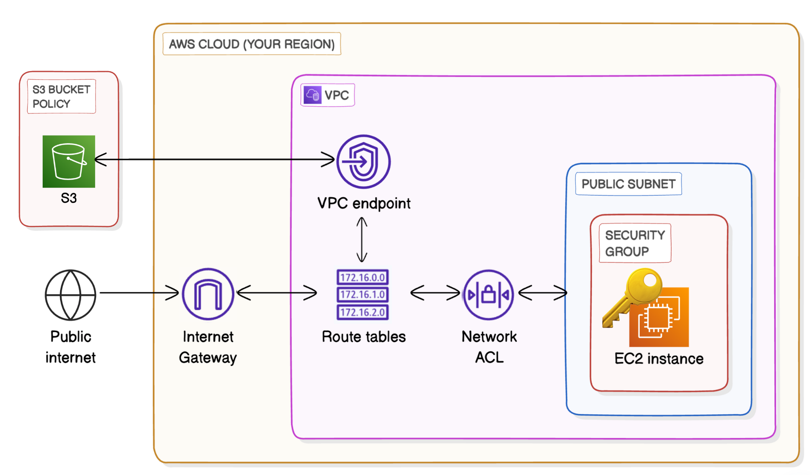
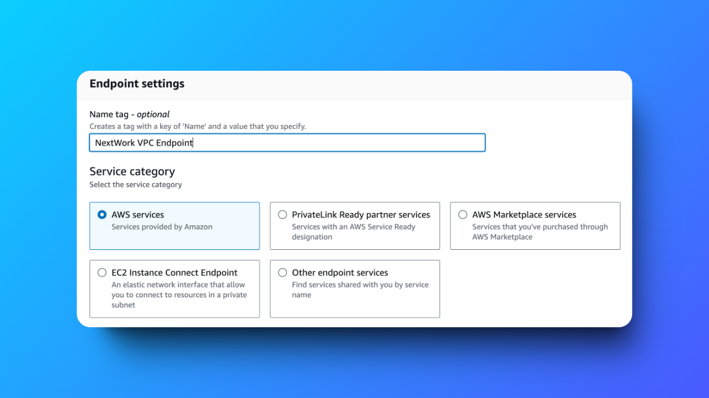
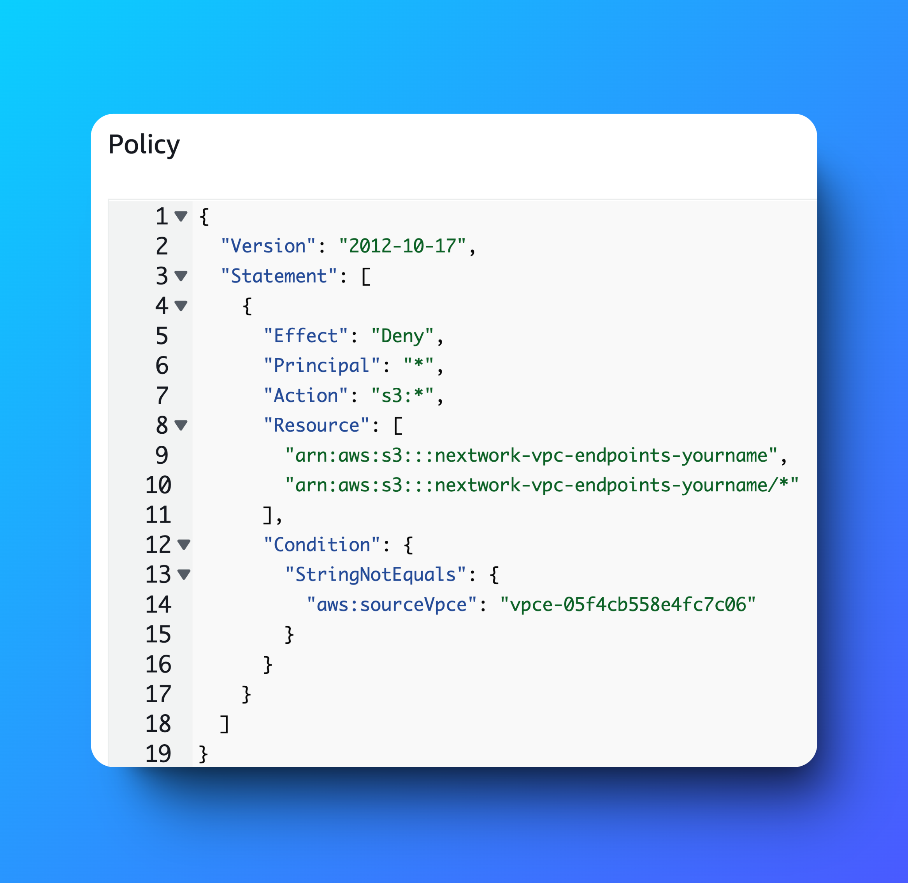

# Secure AWS VPC-to-S3 Communication with VPC Endpoints 🔒

---

## 📜 Table of Contents

1. [Project Overview](#project-overview)
2. [Architecture](#architecture)
3. [Features](#features)
4. [Key Deliverables](#key-deliverables)
5. [Challenges and Lessons Learned](#challenges-and-lessons-learned)
6. [Outcome](#outcome)
7. [Tools and Technologies Used](#tools-and-technologies-used)
8. [Steps to Reproduce](#steps-to-reproduce)
9. [Screenshots](#screenshots)
10. [Acknowledgments](#acknowledgments)
11. [Author](#author)

---

## Project Overview

This project focuses on establishing a **secure, private connection** between an EC2 instance hosted in an AWS Virtual Private Cloud (VPC) and an Amazon S3 bucket using **VPC Gateway Endpoints**. By bypassing the public internet, the solution ensures that sensitive data remains securely confined within AWS's network.

---

## Architecture

  

- **VPC**: Configured with public and private subnets.  
- **Gateway Endpoint**: Provides direct, secure access to the S3 bucket.  
- **S3 Bucket**: Stores project data while enforcing access policies.  
- **IAM Roles**: Enable EC2 instances to interact with S3 without requiring access keys.

---

## Features

- **Secure Communication**: Eliminates the need for an internet gateway or NAT.  
- **Scalable Access**: Supports high-volume, low-latency data transfers.  
- **Granular Permissions**: Configured using bucket and endpoint policies.  
- **Cost Efficiency**: Avoids NAT gateway or data transfer charges.

---

## Key Deliverables

1. **VPC Design**:
   - Created a custom VPC with subnets and route tables.
   - Configured routing to integrate the S3 Gateway Endpoint.

2. **IAM Role Setup**:
   - Created a role with permissions for secure S3 access.
   - Attached the role to the EC2 instance for seamless AWS CLI use.

3. **S3 Bucket Policy**:
   - Restricted access to the S3 bucket to specific VPC endpoints.
   - Defined a clear policy for least-privilege access.

4. **Verification**:
   - Conducted successful data transfers from EC2 to S3 (`aws s3 cp`, `aws s3 ls`).

---

## Challenges and Lessons Learned

### Challenges
- Configuring bucket policies to allow endpoint-based access while blocking public traffic.  
- Diagnosing permissions issues with IAM roles and endpoint policies.  

### Lessons Learned
- Understanding the interplay of IAM, bucket policies, and endpoint policies is key to securing AWS workflows.  
- Private endpoints significantly enhance security while simplifying architecture.

---

## Outcome

The project successfully implemented a **secure VPC-to-S3 communication** channel using Gateway Endpoints. The solution aligns with AWS best practices for security, scalability, and cost efficiency, proving its value for enterprise-grade cloud applications.

---

## Tools and Technologies Used

- **Amazon VPC**: For private network creation.  
- **Amazon S3**: Cloud object storage for data hosting.  
- **IAM Roles & Policies**: To manage permissions.  
- **AWS CLI**: For testing and automation.  

---

## Steps to Reproduce

1. **Set Up a VPC**:
   - Create a VPC with subnets and configure routing.
   - Attach an internet gateway if public access is needed.

2. **Create an S3 Bucket**:
   - Define a bucket and upload sample data.
   - Configure bucket policies to restrict access to specific endpoints.

3. **Configure Gateway Endpoint**:
   - Create a Gateway Endpoint in the VPC.
   - Update route tables for subnets to use the endpoint.

4. **Attach IAM Role**:
   - Define an IAM role with `AmazonS3ReadOnlyAccess` or custom permissions.
   - Attach the role to the EC2 instance.

5. **Test Connectivity**:
   - Use the AWS CLI on the EC2 instance to interact with the S3 bucket.

---

## Screenshots

### VPC Gateway Endpoint Configuration  
  

### S3 Bucket Policy  

---

## Acknowledgments

Gratitude to the **ALX AWS Community** and **NextWork.org** for their mentorship and resources that guided the completion of this project.

---

## Author

**Hassan Gachoka**  
  

